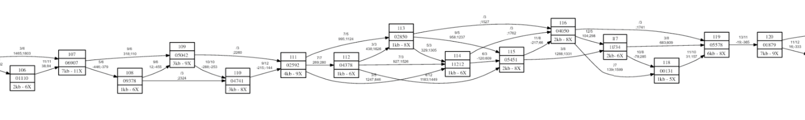
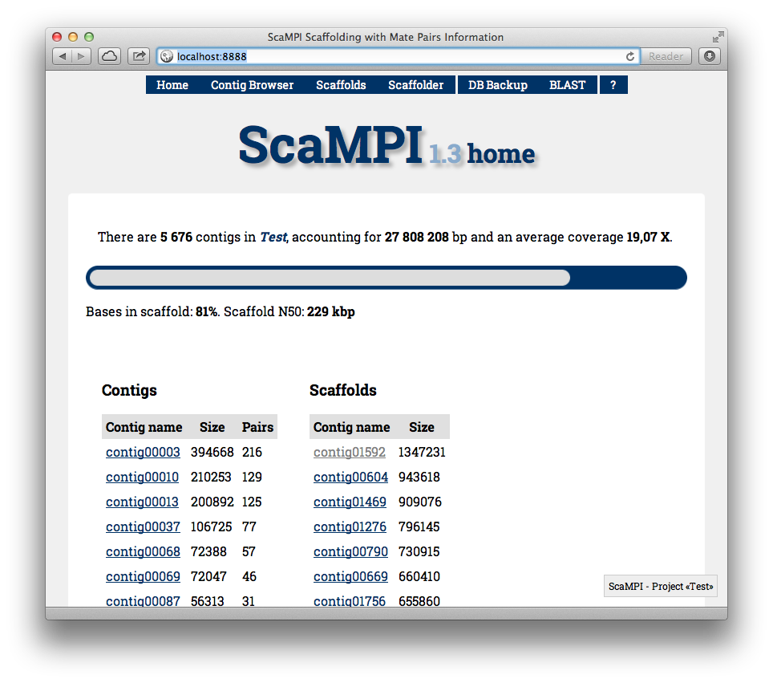
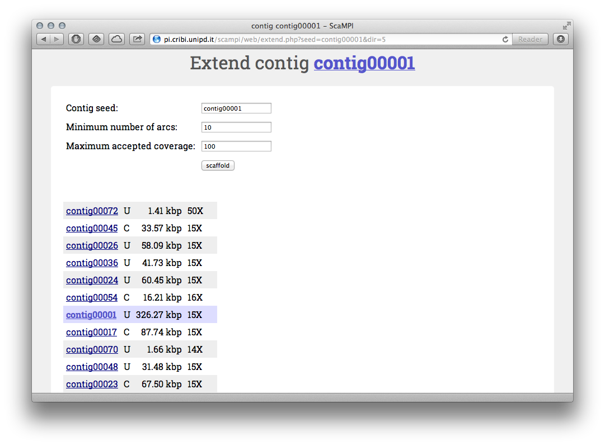
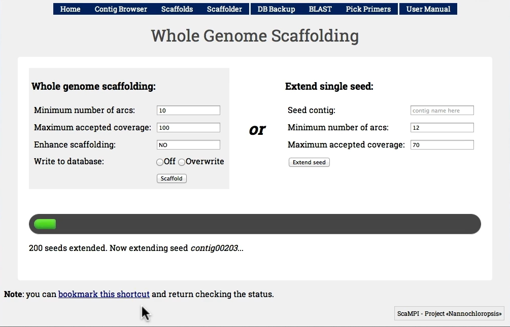
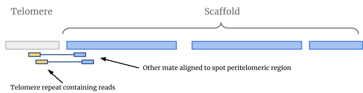
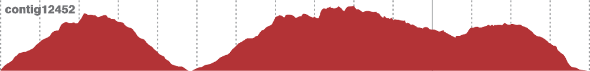
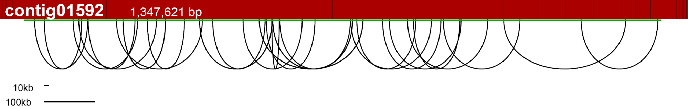

# ScaMPI

_PhD thesis material [archive]_

ScaMPI (Scaffolding using Mate-Paired Information) is a suite of tools used to assemble
the [genome of _Nannochloropsis gaditana_](https://www.sciencedirect.com/science/article/pii/S1674205214602914?via%3Dihub),
which was sequenced between 2009 and 2011 with a hybrid strategy of 454 FLX shotgun and SOLiD v4 Mate Paired libraries.

ScaMPI includes:

* A greedy *scaffolder*, which processes the alignment of color-space Mate Paired reads against the contigs to produce scaffolds.
* A contig integrity check to assess the correctness of the contigs
* A telomeric repeat identification and analysis tool to flag the telomeres in the assemblies
* A tool to validate the scaffolds using Sanger sequences BAC-Ends libraries
* A web interface to manually inspect each contig, their connections, their place in the scaffold, to perform BLAST and primer picking

## Documents

* [Manual](manual/README.md)
* [Thesis](https://www.research.unipd.it/handle/11577/3422939?1/Thesis_last.pdf)

## Screenshots and images

### What is a scaffold

A scaffold is an ordered set of contigs, and ScaMPI allows to render a scaffold with GraphViz

### The web interface

The home page shows a progress bar (bases in scaffold versus total bases), and links to access scaffolds or contigs and plug-ins

Each contig can be visualized and links to other contigs are shown, and clickable. Some of them will lead to wrong paths

A single contig can be used as _seed_ and extended showing the output as a list of ordered contigs (U: uncomplemented, C: complemented)

### Automatic scaffolding

The web interface can launch the automatic scaffolding once the "arcs" and contigs have been imported

### Telomeric repeats identification and mapping

Mate paired reads having one mate flagged as telomeric and the other anchored to a contig, allows the identification of telomeric regions

### Validation of the contigs, via Mate pairs

If the physical coverage of a contig drops, it may indicate a misassembly in the contig itself

### Validation of the scaffolds, via BAC Ends

Mapping the BAC ends allows to check the integrity of scaffolds. Here the red bar is a scaffold (in bright red the contigs).
Black arcs represent the two BAC ends. The green line is the physical coverage of the BAC-Ends.

